# Cheapest Dental Clinic 

Cheapest Dental Clinic is a website that helps patients to find a dentist in London. The patients will be able to contact the practice by phone, email or completing an online form. The patients will also be able to find out informations about the clinic, their team and the treatment costs. 

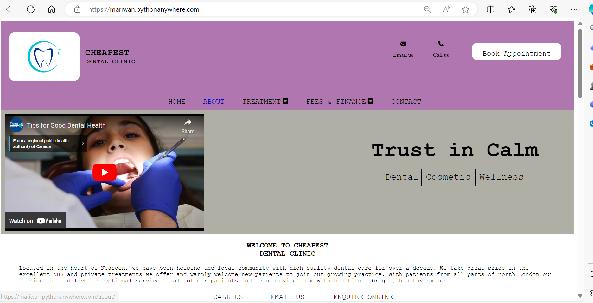 

## Header 
* The practice logo.  
* The telephone number and email address of the practice which are clickable.  
* A button which helps the patient to book an appointment.  
* A horizontal navigation bar on the edge of the header bottom which will allow the user to navigate from page to page on large screen, but on a small screen all pages are inside a hamburger icon.

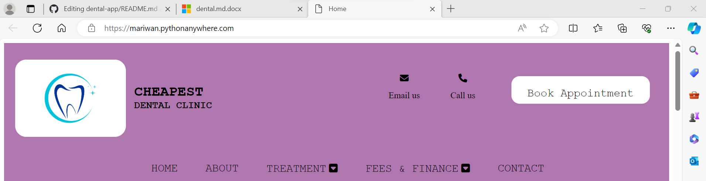  

## Navigation bar 
* Home page informs the user about where the practice is located and for how long they have been helping the community to keep their teeth and gum healthy. There are some links which will allow the user to fill in an online form, call or email the practice. Some of the practice achievements are written on the middle of this page with a button of filling an online form – which is repeated on several pages. There are some quick links, a link of external site and information about their opening hours on the bottom of the page. 

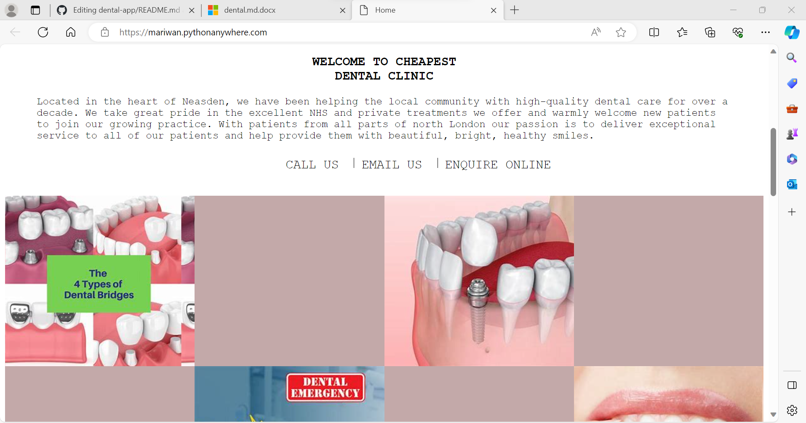 

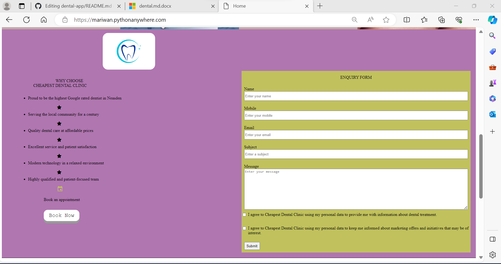 

* About page contains information about each staff which can be found on their individual page.

  
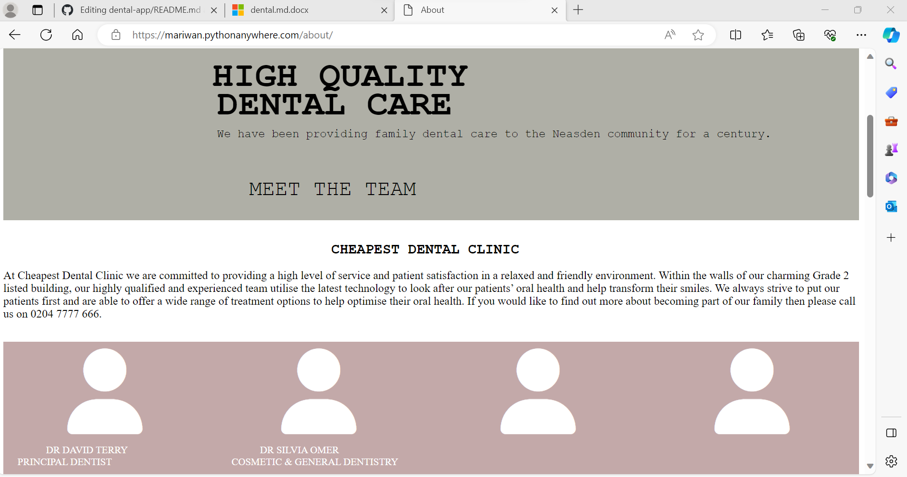 

* Treatment page has a dropdown menu which will allow the user to choose one of three treatments.
  

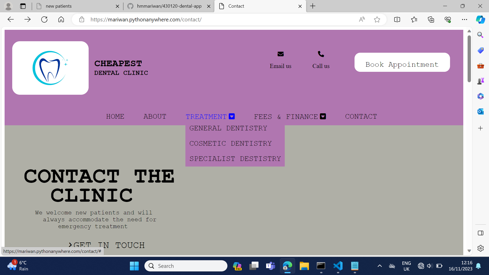 

* Fees & Finance will also have a dropdown menu that helps the user to find out about NHS and private patients.
  

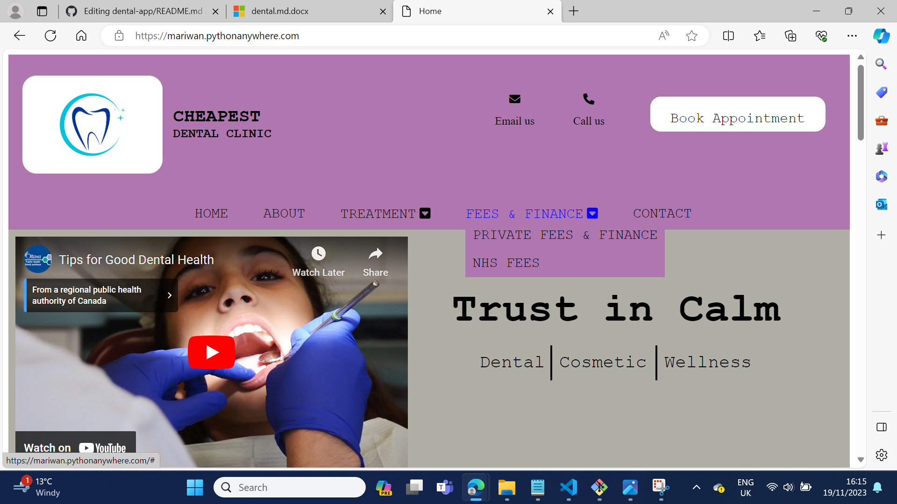 

* Contact page contains an online form, map, and the details of their contact.
 

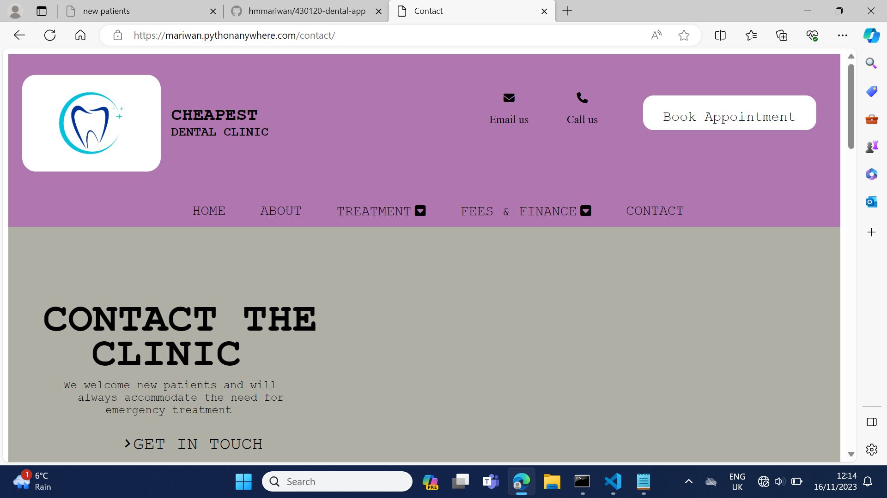

## Footer  

* The footer has a link of different social media which will be open in a new tab.  
* There is an icon of copyright in this section.

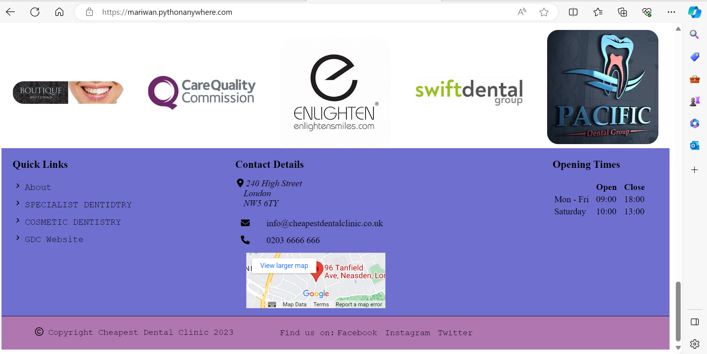 

## Testing 
* In the base.html file, I created a section for an online form, some achievements of the practice and a button that helps the patient to make an appointment. I could use the ‘extends’ template tag to bring all the required codes to a child template or exclude a specific block if I wanted.  
* I had a problem with overlapping of contents in the project. Whenever I reduced the size of the screen, the appointment’s button which was in the header overlapped the telephone and email icons. The problem were repeated in every pages so I used a media query to fix the issue.   
* I created two tables which were adjacent to each other to show the costs of different treatments in the Fees & Finance page, but for a small screen, the right table overlapped the left one, so I changed the value of the property ‘Display’ to ‘Grid’ to fix the issue.  
* The Font Awesome icon did not appear on the position, although I included its link in the head section, so I tried another icon.   
* The first time, I used an external CSS style, but the style of the form, button and page were not changed so I used an internal CSS style which changed the appearance of the page. I found that I incorrectly wrote the path of CSS file, in the link tag.

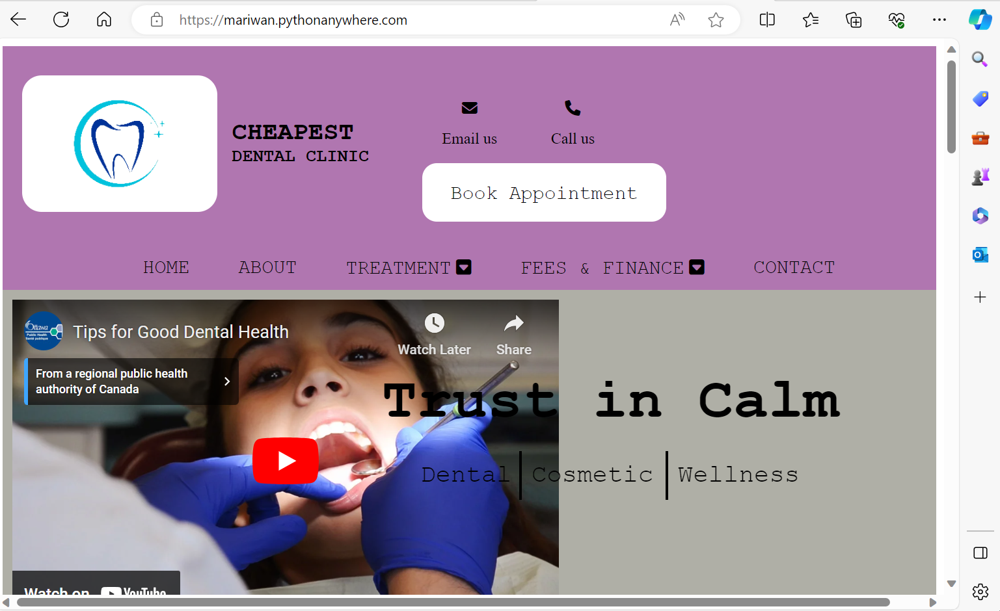 

## Unfixed bugs  
In the project, I used Django to send an email to the owner of the website and the user after submitting an online form. When I run a program at http://127.0.0.1:8000/, the owner and the user received the email.   
I also used PythonAnywhere to deploy the website which worked, but when the user submitted the online form, I received the below error, then when I went back to the previous page, the successful message of submitting the form was shown on the website. I was unable to fix this problem because I think I have a free account with them.

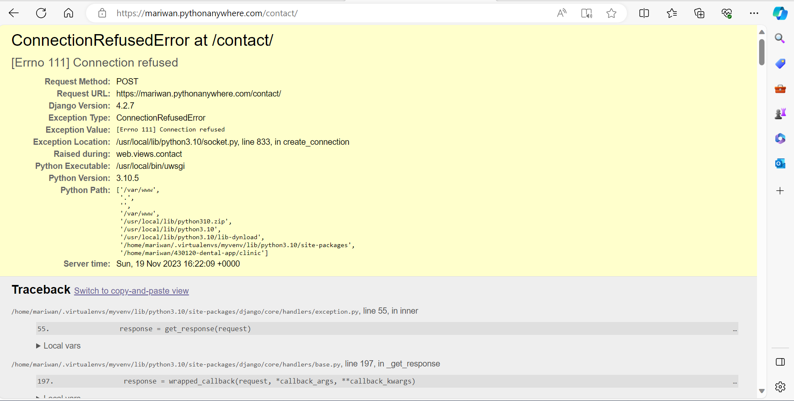 

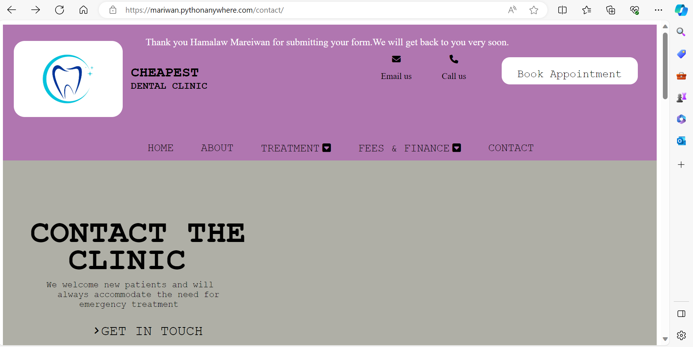 

## Content  
* I got the contents of the site form Zental Dental Practice.  
* I used the Font Awsome icon for the dropdown menu and staff.  
* I used Google Font for the calendar icon.  
* W3Schools and AI generator helped with converting the design of the page from large screen to small screen.  

## Media  
*I used Google to get all images and logos.  
*The video is from You Tube.  

  

 

 
